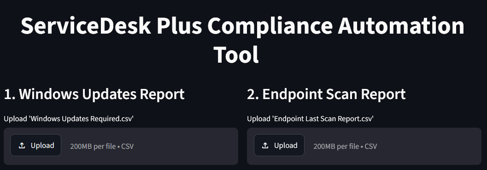
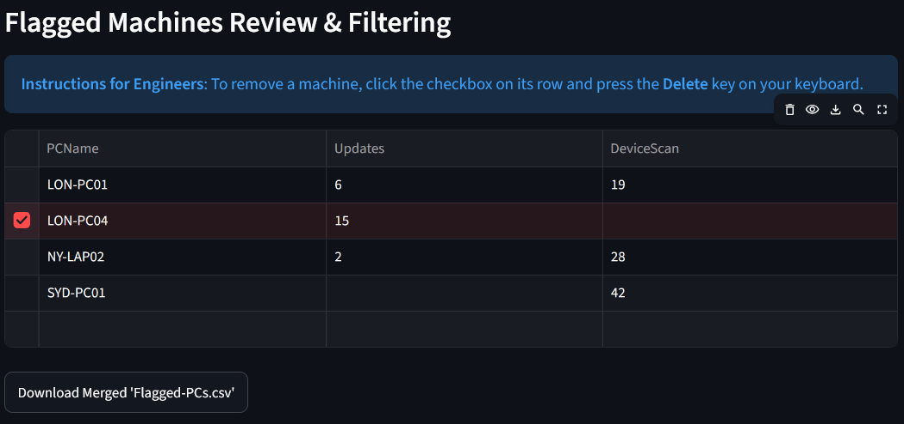
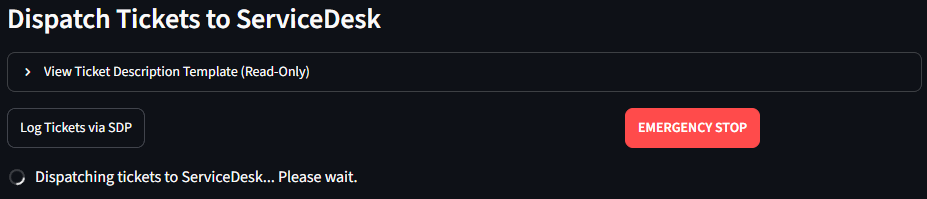
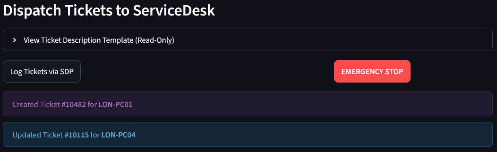

# 💻 ServiceDesk Plus Compliance Automation Tool

A secure, high-performance Streamlit web application designed to merge, clean and process device compliance reports.
Enabling IT Support teams to automatically log or update tickets in **ServiceDesk Plus (SDP)**. 

Built with **Python**, **Streamlit** and concurrent batch processing (`ThreadPoolExecutor`).  
This tool speeds up ticket generation while maintaining real-time audit control and emergency stop capabilities.

[](https://opensource.org/licenses/MIT)
[](https://www.python.org/)
[](https://streamlit.io/)

---

## 📁 Repository Structure

* `app.py` - Core Streamlit interface, CSV parsing logic and SDP API dispatch handlers.
* `config.py` - Central configuration file for site mappings, CSV header offsets, admin RBAC lists and SDP ticket templates.

*Customisations are done within `config.py`*

---

## ⚡ Key Features

* **Parallel Processing Engine:** Dispatches requests concurrently in batches of 5.
* **Automated Data Sanitisation:** Strips metadata header noise, normalises hostnames and matches records across report types.
* **Smart Ticket Handling:** Identifies existing open tickets to append notes rather than creating duplicate tickets.
* **Emergency Stop & Audit:** Instantly stops outgoing API requests and outputs an audit log of all actions taken prior to cancellation.
* **Stateless & Private:** Session data runs in memory and clears automatically when the tab is closed or refreshed.

---

## 🖼️ Interface Preview

### 1. Upload CSVs
Upload raw CSV exports (e.g Windows Updates & Endpoint Scan reports) to correlate missing updates and check-in activity.



### 2. Merged Review
Interactive review table of the merged results.



### 3. Concurrent Dispatch
Monitor real-time ticket creation with progress indicators and emergency stop protection.



### 4. Audit Preview
View which machines have had a ticket created or updated.



---

## 📁 Repository Structure

```
sdp-compliance-tool/
├── app.py              # Streamlit dashboard UI and SDP dispatch logic
├── config.py           # app settings, site mappings and ticket templates
├── requirements.txt    # python package dependencies
└── README.md           # project documentation
```

---

## 📋 Prerequisites

* **Python:** 3.10 or higher.
* **ManageEngine ServiceDesk Plus:** Cloud or On-Premise instance with REST API v3 access.
* **Azure AD / SSO App Registration:** If enforcing organisational SSO.
* **API Credentials:** SDP OAuth2 credentials with specified scopes mentioned in the ***SDP API Scope*** section.
* **Streamlit Cloud:** This app is setup to work on Streamlit Cloud, which provides the main UI.

---

## 🔬 SDP API Scope

The scope required for the service account used by this application:
```text
SDPOnDemand.requests.CREATE,SDPOnDemand.requests.READ,SDPOnDemand.requests.UPDATE,SDPOnDemand.assets.READ
```
This allows the app to check if any tickets already exist (`SDPOnDemand.requests.READ`), create new tickets (`SDPOnDemand.requests.CREATE`), update existing tickets with new information (`SDPOnDemand.requests.UPDATE`) and read the asset register on SDP for asset state/user information (`SDPOnDemand.assets.READ`).

---

## 🚀 Installation & Setup

### 1. Clone Repository
```bash
git clone https://github.com/OriginalMistake/sdp-compliance-tool.git
cd sdp-compliance-tool
```

### 2. Create Virtual Environment & Install Dependencies
```bash
python -m venv venv
source venv/bin/activate  # on Windows use: venv\Scripts\activate
pip install -r requirements.txt
```

### 3. Configure Secrets (`.streamlit/secrets.toml`)
Configure your local secrets file *(or Streamlit Cloud Secrets manager)*:

```toml
[azure]
client_id = "your-azure-client-id"
tenant_id = "your-azure-tenant-id"

[sdp]
client_id = "your-sdp-client-id"
client_secret = "your-sdp-client-secret"
refresh_token = "your-sdp-refresh-token"
accounts_url = "https://accounts.manageengine.com"
api_domain = "https://your-sdp-instance.com"
```

### 4. Run the Streamlit App
```bash
streamlit run app.py
```

---

## 🛠️ Configuration (`config.py`)

All site-specific settings, thresholds and mappings are centralised in `config.py`.

### 1. Adjusting Compliance Thresholds
Update the default filtering logic to match your IT security policies:
* `MIN_MISSING_UPDATES = 1` - Minimum required missing critical updates to flag.
* `MIN_INACTIVE_DAYS = 14` - Minimum allowed days since last endpoint check-in/scan.

### 2. CSV Header Skip Logic
Adjust header row offsets based on how your reporting tools export reports:
* `UPDATES_SKIPROWS = 11` - Metadata rows skipped for the Windows Updates CSV.
* `SCAN_REPORT_SKIPROWS = 3` - Metadata rows skipped for the Endpoint Scan CSV.

### 3. SDP Ticket Template & Site Mapping
Customise site routing and default ticket content:
* `get_site_from_pc()` - Maps device hostname prefixes to their corresponding SDP Site names.
* `ADMIN_USERS` - List of engineer email addresses granted admin access to modify templates within the app interface.
* `DEFAULT_TICKET_TEMPLATE` - Template string sent to SDP containing dynamic tags like `{PCName}`, `{Updates}`, `{DeviceScan}`, `{Site}`, `{AssetState}`, and `{AssignedUser}`.

### 4. Parallel Worker Limits
`MAX_WORKERS = 5` - Defaults to 5 concurrent threads to balance speed with SDP rate limits. Adjust based on your API server capacity.

---

## 🧠 Logic Flow

```text
[ Raw CSV 1: Windows Updates      ] ────┐
                                        ├──> [ Normalise Hostnames & Filter ] ──> [ Parallel Dispatch (5 Workers) ] ──> [ ServiceDesk Plus API ]
[ Raw CSV 2: Endpoint Scan Report ] ────┘
```

1. **Upload & Parsing:** Raw CSVs drop into designated slots, automatically stripping metadata headers based on offset rules in `config.py`.
2. **Key Matching:** Normalises hostnames (uppercase, strips domain suffixes) to cross-reference data.
3. **Threshold Check:** Flags devices with missing updates or inactive days above defined limits.
4. **Execution:** Submits concurrent API payload requests to SDP to fetch open tickets or create/update them dynamically.

---

## 💬 Issues & Support

If you encounter a bug, have a feature request or run into issues with report formatting:

1. **Check existing issues:** Search the GitHub Issues tab to see if it has already been reported.
2. **Open a new issue:** Provide details about expected vs. actual behavior, along with relevant error logs (ensuring no sensitive data or credentials are included).
3. **Pull Requests:** Contributions are welcome! Feel free to fork the repo and submit a PR.

---

## 📄 License

Distributed under the MIT License. See `LICENSE` for more information.
